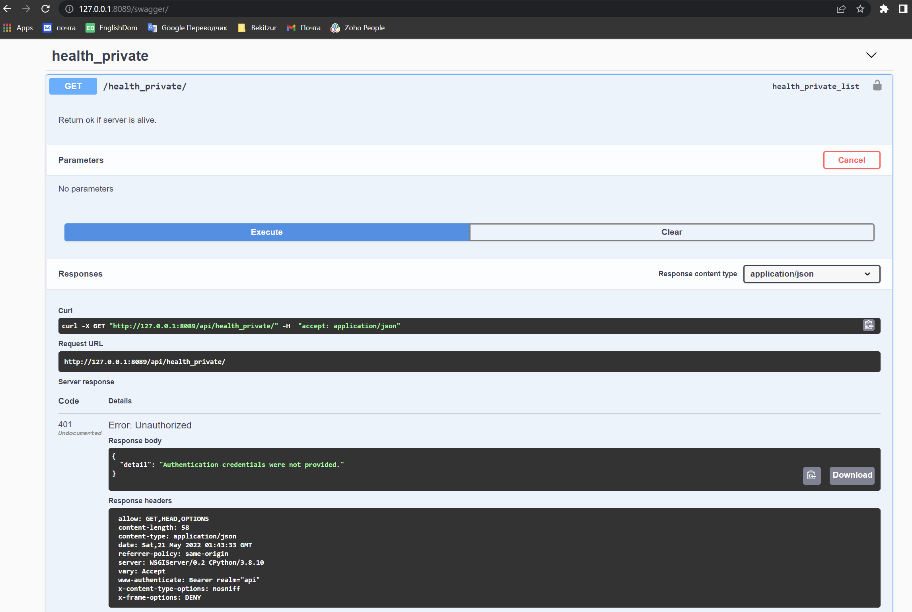
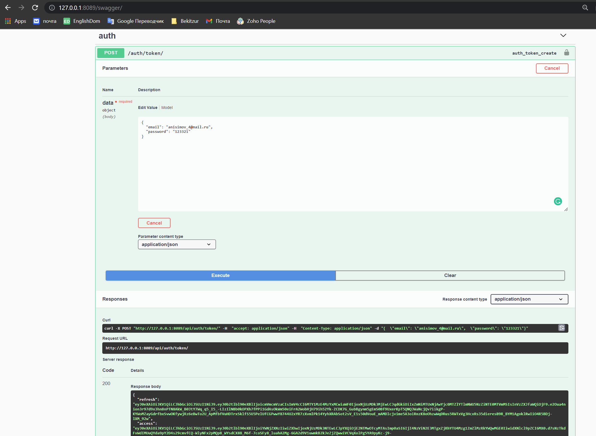
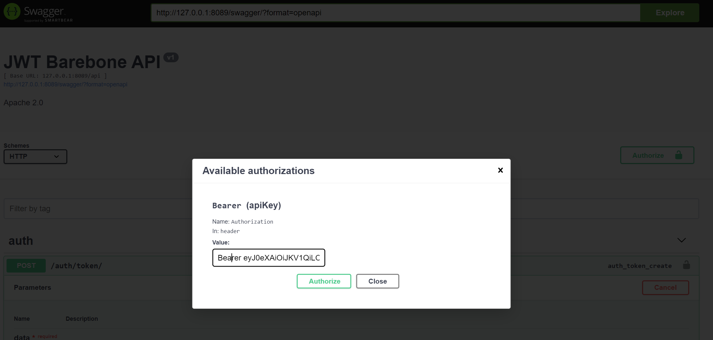
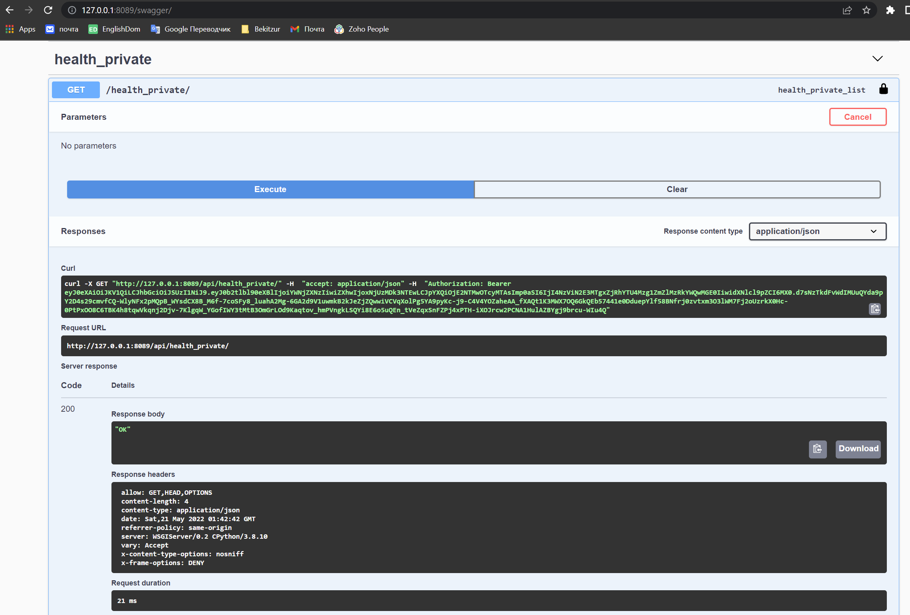

# Django JWT Barebone for email + password authorization

## Installing application

1. Clone project:
```
git clone https://github.com/anisimovih/DjangoJWTEmailBarebone
```

2. Setup empty python virtual environment
```
virtualenv -p python3.8 .venv
source .venv/bin/activate
```

3. Install project requirements to your local virtual environment:
```
pipenv install --dev
```

4. Create .env file with your local settings containing:
   * SECRET_KEY
   * HOST_IP
   * HOSTNAME
   * DATABASE_NAME
   * DATABASE_HOST
   * DATABASE_PORT
   * DATABASE_USER
   * DATABASE_PASS
   * DATABASE_CONN_MAX_AGE
   * SIGNING_KEY
   * VERIFYING_KEY

5. Import vars from .env file:
```
export $(cat .env | xargs)
```

6. Migrate database scheme:
```
python manage.py migrate
python manage.py createsuperuser
```

8. Start server:
```
python manage.py runserver 127.0.0.1:8000
```

9. Run tests to make sure everything is installed correctly:
```
./manage.py test
./flake-test.sh
```


## Using application

1. Go to url: http://127.0.0.1:8000/swagger/

2. Try using the `/api/health_private/` endpoint. Your request must be denied because you are not authorized:

    

3. Use your email and password in `/api/auth/token/` endpoint to get a JWT access token:

    

4. Click the authorization button at top right corner and paste value as `Bearer {access_token}`:

    

5. Try using the `/api/health_private/` endpoint again. Now you should get a response:

    